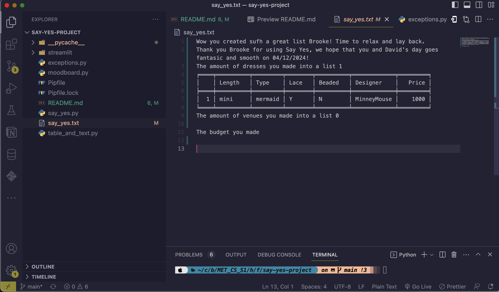
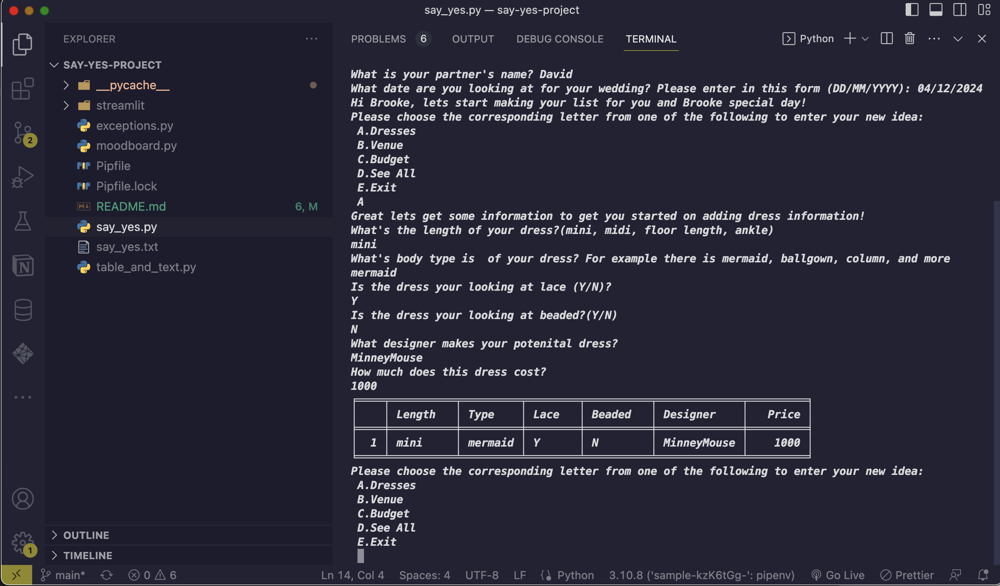
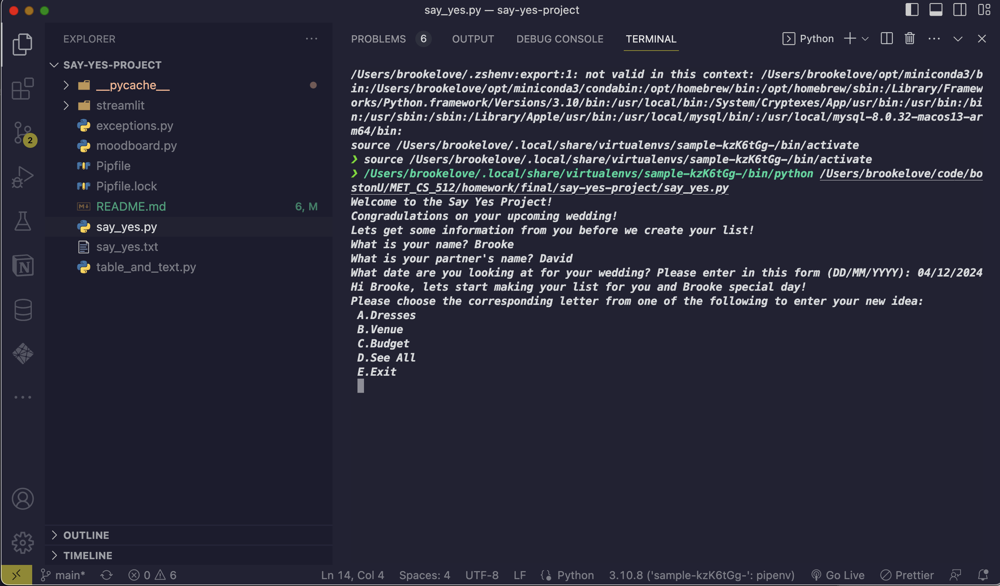

# say-yes-project

## Description

 Weddings can be chaotic; it can be hard to keep track of what you do noy and do like even if you have a wedding planner. With technology at our fingertips presents many more opportunities for brides and grooms to have vast access to some of the most expensive items for the wedding, the dress and venue. With all of the opportunities it can be hard to keep track of potential dresses and venues, I created an program in python that allows the user to enter potential venues and dresses that they like and then produces a documented table of all the potential venues for the user to see!

This program allows potential items to be viewed at once where a user can see what lies in front of them. The program asks questions that allows the user to look at all the items they are interested in and allows a user to take into account their budget as well as other factors. Then provide a text file that they can physically take to meetings with their partner, family, wedding planner, and more to give others a visual of their budget and what they desire to make their day special.

The Say Yes Project prompts users to enter wither name their partners name and their potential wedding date. Then proceeds to a menu where they can choose from several options to enter either their budget, venue or dress options. On user’s choice they will answer the following questions that allow them to see that their data of the item has been entered into the data. The only option that the data will override is on the budget because the user can change the budget depending on the items that they choose. Once user’s ready to complete their table they will exit and a file called say_yes.txt will be created or rewritten where the user can look at their results together

## Usage

This application was one of my first bigger Python projects. I completed this for my final assignment in my Boston University class. I wanted to create something that would help me in my dauly life and at the time I am planning for my wedding. This application allows a user to keep track of 3 main categories that most brides use; dresses, venues, and budget.

## Images

## Installation

 Beacause of the usage of one Third-Party API in the program called Tabulate. In order to use this application, the user will have to do the following: 
    1. Depending on your system and what you currently have installed navigate to your command prompt application 
    2. Type `pip install tabulate` and press enter 
        - The prompt can depend on the type of application so depending if you have a certain version of python or use a specific type of interpreter / virtual environment your command might change. 
        - I have included a link that will show you the command that you should enter based on either your interpreter or which Python is installed in your system [Tabulate Installation](https://bobbyhadz.com/blog/python-install-tabulate)
        - I had ran across this error during my  initialization of the code. If you have an error returning “ModuleNotFoundError: No module named 'tabulate' in Python". This means that where `pip` does not exist please first install it using this command `python -m pip install tabulate`. This step can also be found in the link above. 

## Tools & Dependencies

    Pipfile, Table, Tabulate

## Future Directions

I want to add in a Front-End look that allows for greater in teraction between students. I was trying to implement Streamlit but, at the time I did not dedicate enough time to learning a new type of language and not complete my alread dedicated tasks.